# Testing

- [Validator Testing](#validator-testing)
  * [HTML Validator](#html-validator)
  * [CSS Validator](#css-validator)
- [Lighthouse Testing](#lighthouse-testing)
- [Compatability & Responsiveness Testing](#compatability---responsiveness-testing)
- [User Story & Feature Testing](#user-story---feature-testing)
  * [Navbar](#navbar)
  * [User Authentication - Allauth](#user-authentication---allauth)
  * [Club Shop](#club-shop)
    + [Display Products](#display-products)
    + [Search bar](#search-bar)
    + [Sort Products](#sort-products)
  * [Product Details](#product-details)
  * [Shopping Basket](#shopping-basket)
  * [Online Payments & Checkout](#online-payments---checkout)
  * [Profile](#profile)
  * [Contact Form](#contact-form)
  * [FAQs](#faqs)
  * [Footer](#footer)
- [Bugs](#bugs)

<small><i><a href='http://ecotrust-canada.github.io/markdown-toc/'>Table of contents generated with markdown-toc</a></i></small>

## Validator Testing 
### HTML Validator

All HTML validation was successfull. The screenshots can be seen [here](testing/validator/html) 

### CSS Validator
CSS Validator showed no errors. View the screenshot [here](testing/validator/css/css-validator.png)

## Lighthouse Testing
Lighthouse testing was carried out on all pages on both [desktop](testing/lighthouse/desktop) and [mobile](testing/lighthouse/mobile)

## Compatability & Responsiveness Testing
To test the compality of the site across different devices and screen sizes, I used the [dev tools](https://developer.chrome.com/docs/devtools/) that comes with [Google Chrome](https://www.google.com/chrome/?brand=FHFK&gclid=Cj0KCQiAnuGNBhCPARIsACbnLzqcMJxCHBH-BSjGpuwc1I8L4clEMk1vlfWm_VanpbS6tX1knC2AkNkaAgSkEALw_wcB&gclsrc=aw.ds). This is a really handy tool as it allows you to see what you site would look and act like on different screen sizes with the click of a button.

I was satisfied with the look and feel of the site across **all** devices that I tested this on. They were as follows:
* Moto G4
* Iphone 4
* Galaxy s5
* Pixel 2
* Pixel 2 XL
* Iphone 5/SE
* Iphone 6/7/8
* Iphone 6/7/8 plus
* Iphone X
* Ipad
* Ipad Pro
* Surface Duo

## User Story & Feature Testing
### Navbar

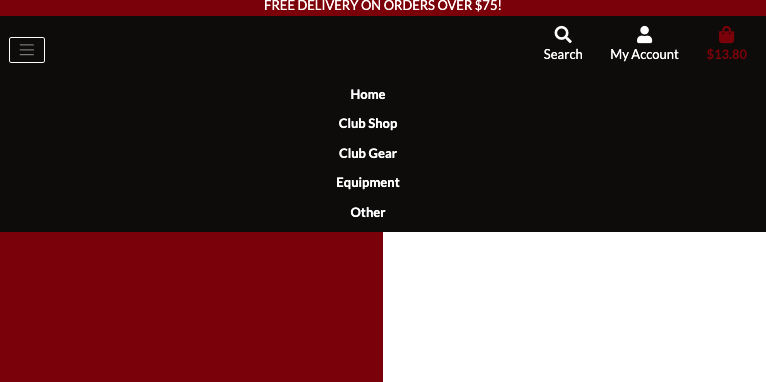

Functionality:

The navbar links all work perfectly and all have the same hover and click state. When the navbar dropdown menu is displayed, all the links in this all work perfectly as well and all have the same font size, hover and click state as well. The user is able to navigate to all areas of the site. In particular, the user is able to navigate to the basket from the navbar and is also able to see the grand total cost of what they have placed into their basket which should make for a positive User Experience. 

Conclusion:
The site's navbar works as expected and is responsive on all screens as noted above. All the links look well and behave in the desired manner. All aspects of the site are navigable from the navbar which allows the user to quickly and easily find their way from feature to feature and this provides them with a positive user experience.

User story satisified: 
* Site navigation to be easy and very intuitive
* be able to view the items in my basket from anywhere in the site

### User Authentication - Allauth

Functionality:

There are various steps to users registering to the site:
1) The clicks the account icon in the navbar. They will see that they can either login or register.

2) When they click to register, the will be directed to the registration page where they will be prompted to input their details including username, email address and password.

3) The user will then be directed to a page with a message to let them know that they need to verify their email address.

4) An email is then sent to the user's given email address with a link to follow which will verify their email address when clicked. Once the user verifies their email, they will be automatically signed in and redirected to the homepage where they would have started out. 

Conclusion:

The user authentication on the site works exactly as it's supposed to with a user being able to easily navigate to where they can login or sign up. Once they sign up, they are then sent an email with a link to follow in order to cofirm their own email address provided is actually theirs. This then completes the user authentication process and the user is automatically signed in. Read the profile testing to see how the user can update their details. If the user wants to delete their profile entirely, they can easily contact the site owners through the contact form and ask for this to be done.

User story satisified: 
* To be able to log in and out easily
* To be able to recover my password if I no longer remember it
* to receive confirmation emails throughout the registration process

### Club Shop
#### Display Products

Functionality:

As this feature suggests, this page is used to display all the products for sale on this site. The users can come here to view any products. When the site owner adds a product via the admin site or in the product management page, it will come up here on this page. The products are all displaying correctly on this page in the desired format with the desired details attached to them such as product categories, prices, names, images. When a product does not have an image attached to it, the product will have a placeholder image instead that signifies that there is no image attached to that product. 

Also, on each product, if the user signed in is a site owner, they will see the edit and delete buttons on each product. The edit button takes the user to the edit product form as seen below.

When the site owner goes to delete the specific product that they want to delete, they are given a warning to make sure that they want to delete the item from the database. This warning is in the form of a modal and is when they click on the delete button again, only then is the product deleted.

conclusion:

To conclude this piece of testing, all the products are displaying in the products page exactly as they are supposed to be displaying, with all the details that are needed to make this a rich and enticing page for the user to have a positive experience while on the site.

User story satisfied:
* be able to view all the products available to purchase
* To be able to add, edit and delete delete products to and from the database

#### Search bar

Functionality:

The search bar that is positioned in the `base template` is available to the users across the entire site meaning that at any point, the user can type in a product's name or in the product description. Through testing this, from all pages on the site, the conclusion is that this feature is fully functional works as expexted.

Once the user has searched for a item through the search bar, it renders the products page with the relevant criteria being searched for. The number of products returned and the search criteria is also noted at the top of the list of items returned.
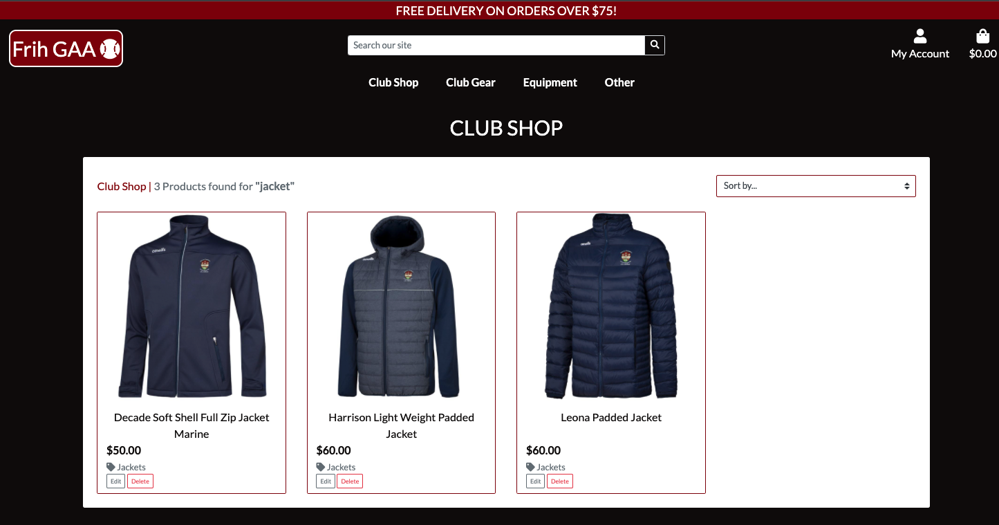

conclusion:

The conclusion from this piece of testing is that the search bar allows the user to search for products using the key words that target the name and description fields of the products.

User story satisfied:
* be able to search the site for products using keywords in the search bar

#### Sort Products

Functionality:

There are a couple of different ways for a user to sort products in the products page. 
1. From the navbar - by price (low-high) or categegory name by (a-z)

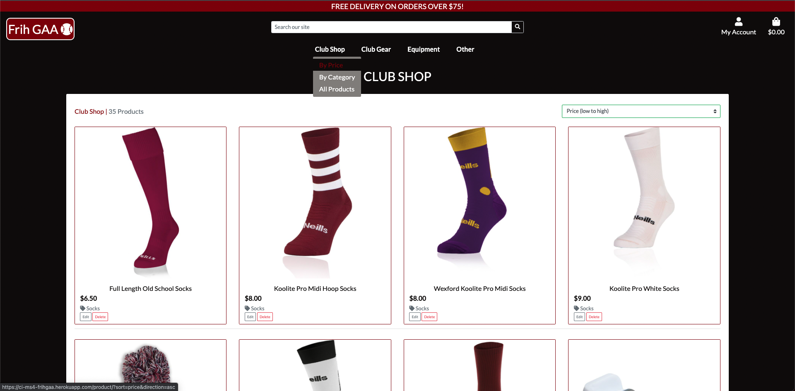

2. From the navbar - by category

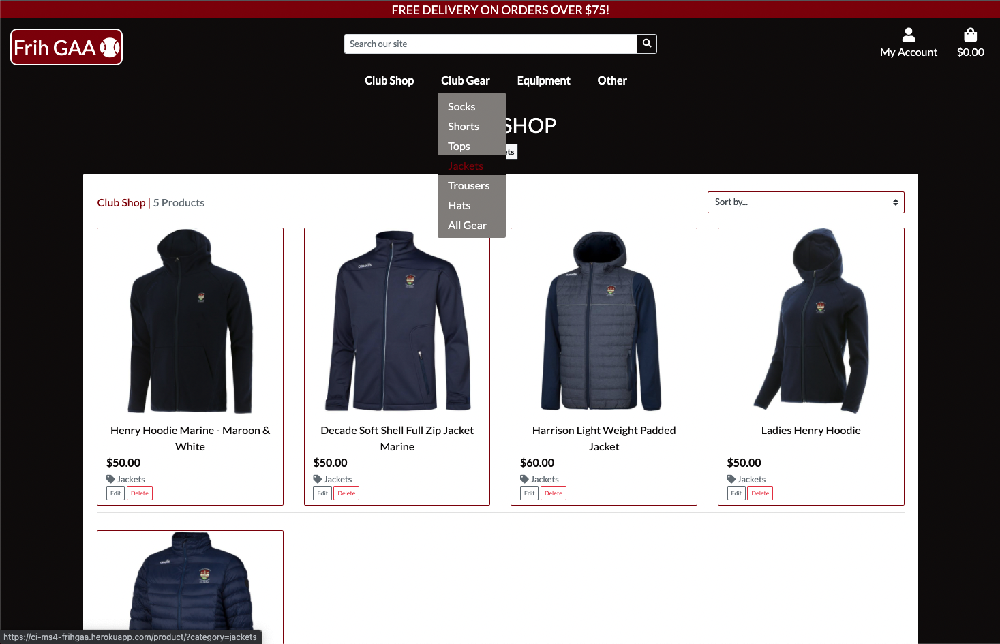

3. From the sort select box on the products page - by name (a-z or z-a), by price (low-high or high to low) or by category name (a-z or z-a).

Conclusion:

You can see from the screenshots that I have tested all of the above methods of sorting products and they all work as expected with products sorting in the desired manner.

User story satisfied:
* be able to sort products by Category/Price/Name

### Product Details

Functionality: 

This page is to give the user a closer look at the product that they want to buy before they make the purchase. There is a product description and a few other details such as whether there are sizes available in this product. The user can then click one of two buttons, to add the product to the basket or to return to the club shop page to view other products. The user also has the functionality to click the amount of that product and can choose a particular size to add as well. 

Once the user adds an item to the basket, the basket preview will pop up in a toast in the top right hand corner of the screen.

If the product has an image, it will be displayed in the space to left of the product as seen above, however, if there is no product image, a placeholder will be there in it's place. The user can click into the product image which will open it in another tab a little bigger.

If the user is a superuser, they will also see the edit and delete buttons that are available on each of the product cards on the products page. If the user clicks the edit button, they will be redirected to the edit product form. The product details will be pre-populated in the form and the image that is currently in the database for that product is displayed in a thumbnail sized version. The user can then edit the details of the product and update click the update button to confirm the changes.

If the user clicks the delete button on the other hand, the delete product modal will come up on the page and make the superuser double check about whether they want to delete the product and if that is the correct product they want to delete.

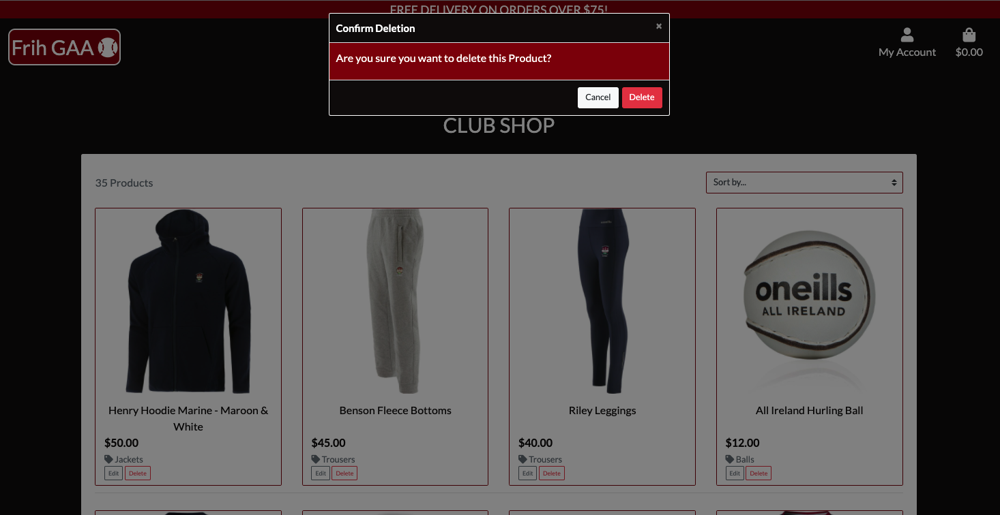

Conclusion:

This feature of the site is functioning as expected with everything working perfectly and all the functionality in order. The below user stories are being satisfied as outlined above.

User story satisfied:
* be able to see a more detailed page about a particular product
* be able to easily add products to my basket

### Shopping Basket

Functionality:

In essence, the basket feature is designed to allow the user to collect items that they would like to buy in a centralised location while the continue for more items to buy. There are other features or pieces of functionality within this though that are covered by this piece of testing. Each item that is place into the basket is displayed on a line with some basic information relevant to that item for the purchase i.e. the product image, name and size, price of the product, the quantity of that size of that product that's in the basket. If there is more than one size of the same product in the basket, it displays on a separate line. 

The user can also use the qunatity increment and decrement buttons on each line item to adjust the quantity. Once they have set the quantity, they can click the update button directly under it to calculate the new subtotal. If they no longer want that product anymore, there is also the remove button that allows them to remove the product from the basket completely. This also updates the subtotal and grand total accordingly. 

At the bottom of screen, the are some more general pieces of information calculated and displayed such as the overall basket subtotal excluding delivery, how much the delivery cost is, how much you would need to spend in order to avail of free delivery and then the grand total of the order. The users can then opt to go back to the club shop to browse for more products, or they can proceed to the checkout via the buttons available at the bottom of the basket. 

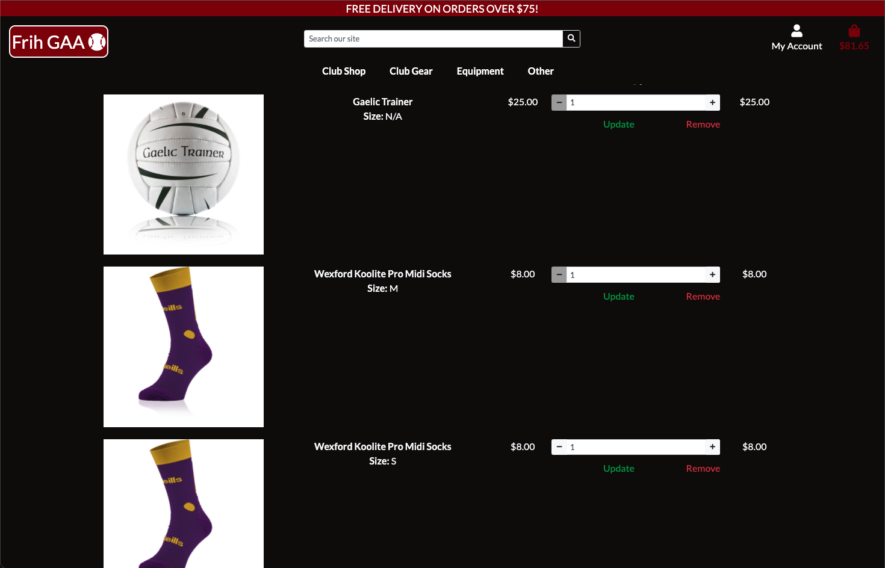

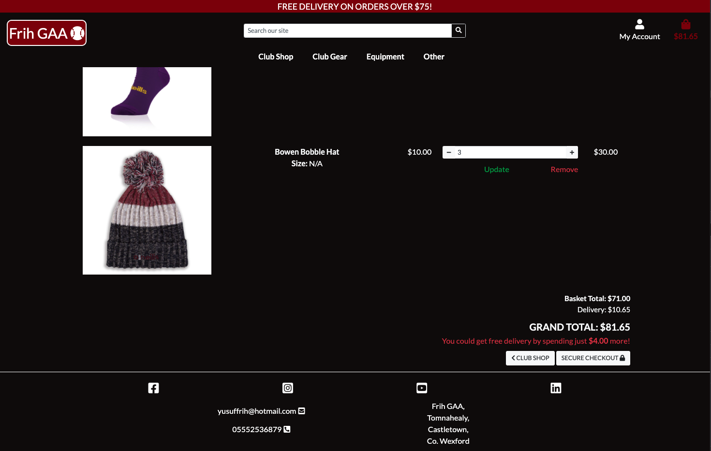

As seen in the images above, when the user has products place in the basket, the basket icon in the navbar changes colour and the cost of the order is rendered under the icon. As it is in the navbar, it can be seen from anywhere in the site.

Conclusion:

After going through all of the steps to add items to the basket of different sized and products and also a product with no size. The correct information was displayed of each of the products and the correct calculations were made and displayed in the correct places. The buttons on the page provide the correct outcome and bring the user to either the products page or to the checkout page where they can begin the payment process and placing their order. 

User story satisfied:
* be able to view the items in my basket from anywhere in the site
* be able to adjust the quantity of products in the basket, from the basket
* be able to checkout from the basket page

### Online Payments & Checkout

Functionality:

Once the user navigated from the basket to the checkout page, the are provided with the following form and order summary on the right of the page and the buttons to confirm the payment or go back to the basket to make some adjustments.

User details - 
The user details are filled in manually if the user is not authenticated. The required information here is just simply the users name and email address so that the order can be sent to the person and so that the person can be contacted in relation to their oder.

Delivery details - 
The delivery details section of the form is again manually entered until such time as the user has saved their preferred information into their profile via the profile feature outlined below. Their information can also be saved if they have placed an order in the past and opted to have information saved via the checkbox located in the form as seen in the screenshot.
The information is quite typical of what is required to be able to send a customer their order. Phone number, address and post code.

Card details - The card details section of the form is from the stripe documentation and is made to look and feel like the rest of the form. This feature communicated with the backend and in turn with stripe to send the order and payment information. Once the payment is confirmed, the user is then directed onto the checkout success page.  

Buttons - In order to checkout, the user needs to submit the form to the view via the complete order button. The button on the left will take the user back to the basket to be able to make changes to their order and then go back to the checkout page again if desired. 

Checkout order summary - On the right of the screen is the order summary which is designed to give the user one last look at what they are paying for. This section is similar to the basket in that it displays the basket items in lines and has a very summarised version of the relevant information as well as the subtotals and total and delivery costs. 

Checkout success page and confirmation email - 
Once the payment is successful, the user is redirected to the checkout success page as seen in the screenshot below. This page consists of the order summary and a message on the top of the screen in big writing to say thanks and that an email confirming the order will be sent to the user shortly. Also on this screen is a toast on the top right hand-side of the screen confirming the order and providing the user with the order number. On the checkout success page there is also another button to take the user back to the club shop to have one last browse before they finish up. 

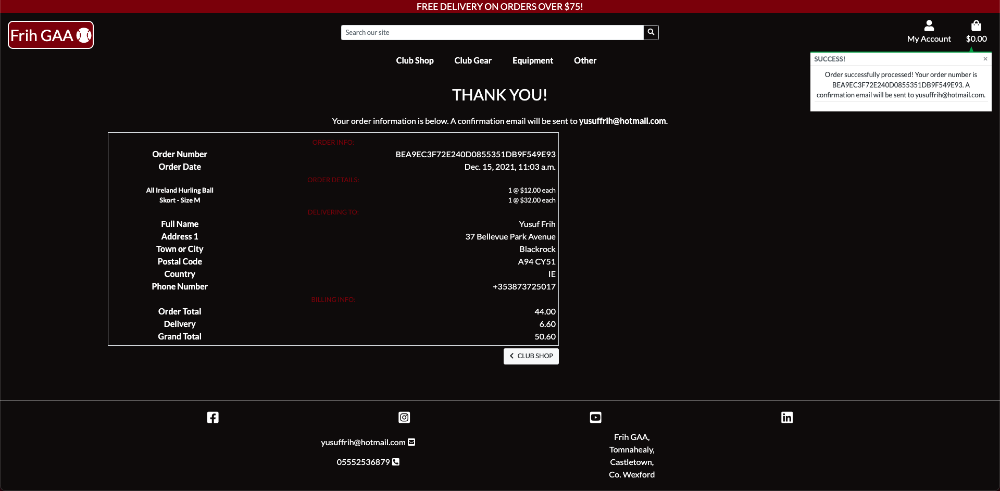

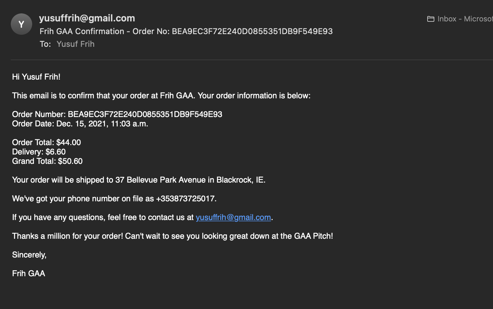

Conclusion:

All of the features outlined above work as expected to satisfy the below user stories. This part of the process is quick, easy and pain-free for the customer and it informs them of exactly what is happening and what to expect.

User story satisfied:
* be able to easily enter my payment details and make payments
* be able to hava my delivery and payment details autofill in checkout once I have a profile
* recieve an order confirmation email directly after checkout

### Profile

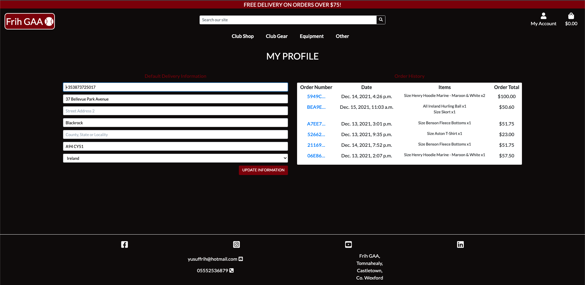

Functionality:

This page is designed to allow the user to save their profile information to the site to allow them to be able to checkout more easily and efficiently for the next time they want to make a purchase. The page is made up of two sections, the user details form and the update button on the left side of the screen followed by the orders that the user has placed in the past. 

The user can change their saved information at any stage and click the update profile button to make these changes take effect. 

Each order that the user has made contains a link to the previous order history on via the order number as seen in the blue writing. This link will take the user back to the checkout success page with a message at the top letting the user know that this is a past order. Also on this page is button to take the user back to their profile page.

Conclusion:

All of the functionality on this page works as it's supposed to with the user details being pulled from the database and entered into the form if it's available during the get request in the view. The order history is also pulled and displayed in the table as expected. The user is easiy able to follow the link in the order number and view the details of that order as seen in the screenshot.

User story satisfied:
* To be able to register a profile on the site with all my details
* To be able to view my profile details and past orders

### Contact Form

Funcionality:

The contact form is there to give the user the ability to send the site owners a message or query via the form on the site which is really easy to find and really easy to use. The contact form is made up of a form from the contact model and displays as a crispy form as do the rest of the site's forms. It consists of four different fields to be filled out by the user and two buttons at the bottom of the form. One of the buttons is to cancel the attempt to submit a query or message to the site owner and the other button is to submit the form to the backend where it will be saved to the database. Once the submit button is sent, the user is then redirected to a page to let them know that the contact form has successfully been submitted and that the site owners will try and revert to the user in 5 days. A toast message also pops up on the top right hand corner letting them know of successful entry of the contact form. The user also then receives an email to acknowledge that the form has been received and that the site owner will endeavour to revert in the 5 days. 

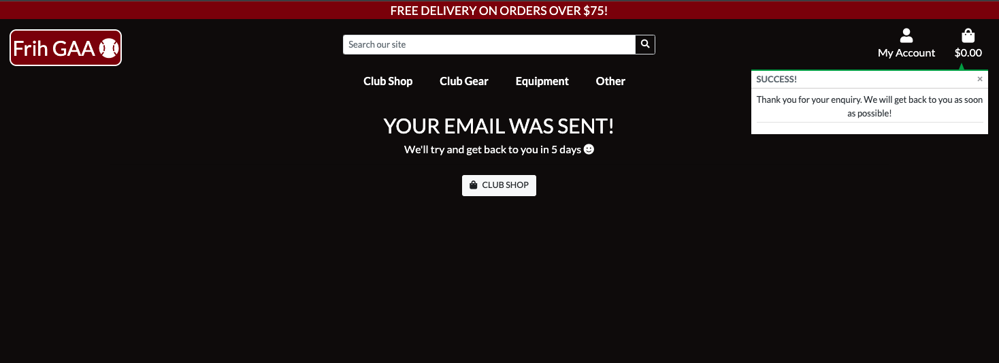

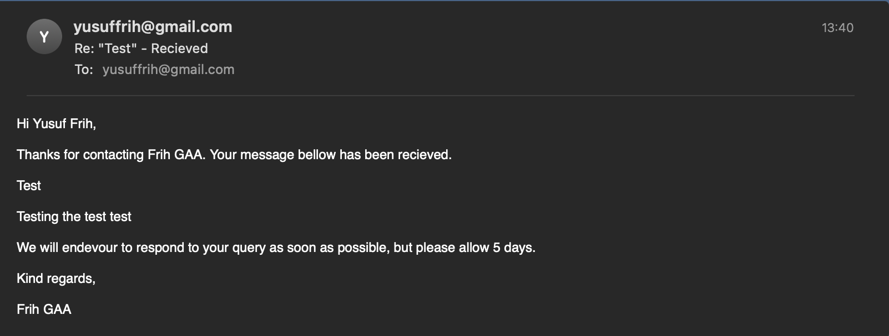

Conclusion:

The functionality of this form works exactly as expected. The user can fill out the form and submit it. There is also form validation in place as the the user's name and email address are required for the site owner to be able to respond to the email. 

User story satisfied:
* be able to contact the site owners easily through a contact form on the site
* receive an acknowledgement email to let me know my contact form has been submitted

### FAQs

Functionality:
The user navigates to the FAQ page via the 'Other' link in the navbar. When they arrive, they will see a list of FAQs displayed in individual cards very attractively in maroon boxes that turn black when the cursor hovering over them. 

If the user is a superuser, they will see the two buttons attached to each of the FAQ cards. One is an edit button and the other is a delete button. Once the delete button is pressed, a modal will pop up ontop of anything else on the screen and ask if they are sure that they want to delete the FAQ. 

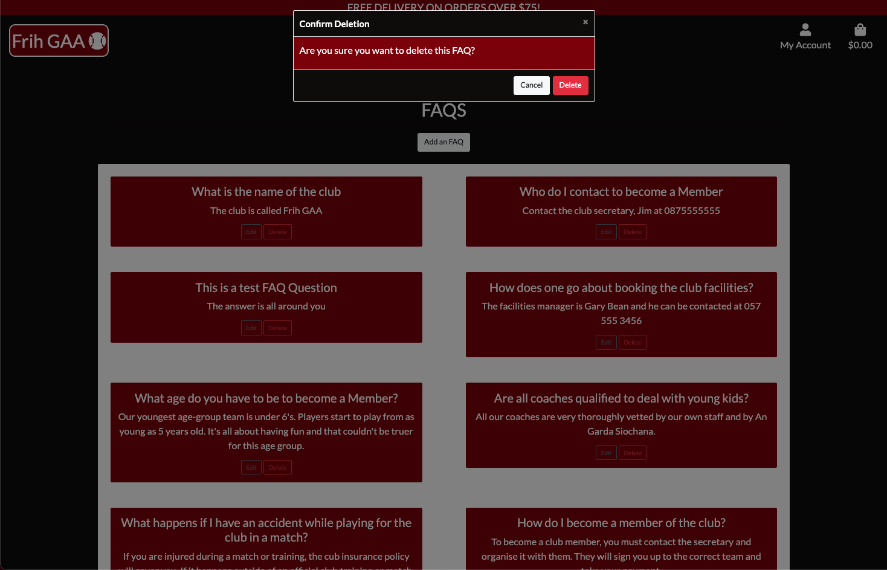

If the user clicks the edit button, they are redirected to the Edit FAQ page seen in the sreenshot below. There is also a toast message that pops up and lets the user know that they are editing the FAQ in question. The form is prepopulated with the existing information in the two fields, question and then answer. There are two buttons on the page. One to submit the updated FAQ and the other is to cancel which will redirect the user back to the FAQ page.

The edit FAQ form is basically the exact same as the add FAQ form which can be accessed from the button that's visible at the top of the FAQ page if the user is a superuser. Is is the case in the edit FAQ page, there are two buttons on the page. One to submit the updated FAQ and the other is to cancel which will redirect the user back to the FAQ page.

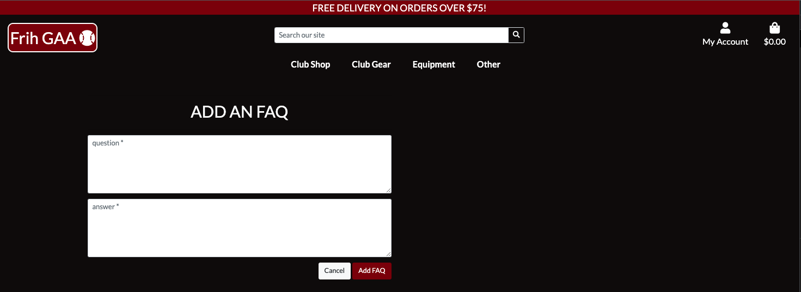

Conclusion:

The FAQ feature works perfect, as the user would expect and satifies the user story outlined below.

User story satisfied:
* Be able to view a list of FAQs on the site to find out more information about the club

### Footer

Functionality:
The footer is a feature that is on nearly every website and application these days and this site is no exception. The footer is found at the foot of the site across all pages and so is found in the base template for this reason. 

The footer contains social media links which can bring the user to the the social media pages of the club so that they can keep up to date with what's going on.

Underneath the social media links, the site's email address is found in case the user want to send an actual email with attachments to the site owner rather than contact them through the contact form on the site. If the user clicks on the email link in the footer, the user's device will open an email window with the "to:" field pre-populated. There is also a phone number and the club's address in the footer which will allow users find the club easily and send any physical correspondence.

As outlined above, the footer as well as the rest of the site is responsive. 

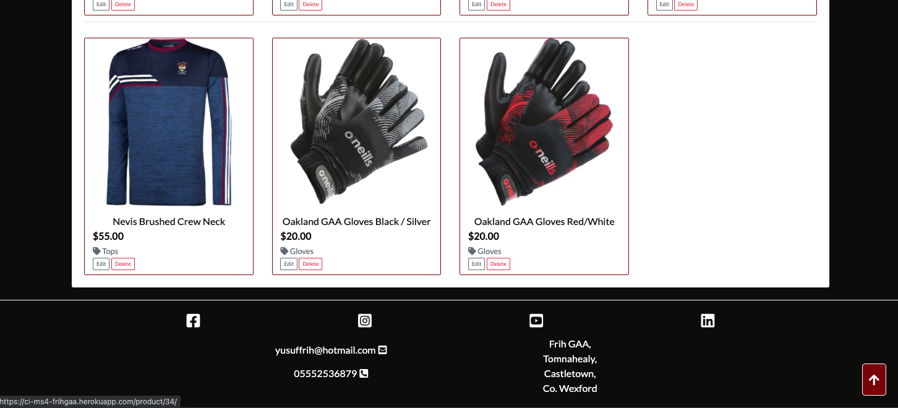

Conclusion:
Each social media page works perfectly and takes the user to the relevant page. All the links take the user to the correct sites and the email one opens the user's email app with the to: field prepopulated.

User story satisfied:
* Be a able to view some basic details about the site owners in the site footer
* Be able to navigate to the site owners social media pages from links in the footer to be able to discover more about the club

## Bugs

Below are some of the bugs that I encountered during the development of this project. One learning that I would definitely take away from reading these is to take extra care when typing. I seem to make many typing mistakes which can be very difficult to find in retrospect. 

1. 
**Issue:** When deploying to Heroku, I managed to push my postgres database url to Github. 

**Fix:** I luckily did not have any data in the database so I decided to delete the database and create a new one with a new url which fixed the threat to the security of the site.

2. 
**Issue:** I put the heroku app name into my Procfile instead of the django app name. This was causing a H14 Heroku error (No web services running).

**Fix:** I changed the app name to the name of the project level app in the django virtual environment instead of Heroku and this got rid of the error that was being thrown.

3. 
**Issue:**  I made a syntax error when wiring up the production database to the settings file - 'default': dj_database_url.parse('DATABASE_URL'). This was causing the live site to not be working correctly.

**Fix:** Changed the above mistake to: 
‘default': dj_database_url.parse(os.environ.get(’DATABASE_URL’)). Once this change was made, the live site was functioning correctly.

4. 
**Issue:** Stripe API Keys not working white the user would try and make a payment. There was an error message showing on screen for this.

**Fix:** The stripe public API key was not registering correctly. I could not figure this out for a long time and decided to try and change the API keys in Stripe and in my environment variable to try and fix the issue. This created another issue where the workspace was still picking up the expired API key. I had a to restart the workspace to register the new variable. In the end, the fix was simply that the context variable in the view was wrapped as a string rather than just being a variable.

5. 
**Issue:** On placing an order and making payment for the order, I would check the user profile and see that the order placed had been duplicated in the database. 

**Fix:** I spent ages looking for the cause of the issue, but in the end it was as simple as a typo in the checkout view’s original_basket variable. This caused the webhook in stripe to search for the incorrect viariable. When it couldn't find the order with this key attached to it, it would the create the order again.  

6. 
**Issue:** When I deployed to Heroku and more specifically when I had set up real emails to be sent from Django, sign-up and email verification process would break. 

**Fix:** For a long time, I did not understand where the issue was coming from. But after a lot of examination, I decided to try and turn off email verification for new users. This fixed the issue. As Email verification is not assessed in the MS4 I decided to leave email verification off. I later found out that this was an issue with Google and not with how I set it up. The email verification was working when in Development.

7. 
**Issue:** The above bug 6 did not actually fix the overall issue that was the real emails being sent to the users was not working. This bug had me stumped for a while and I couldn't understand why the emails were being sent in development but not in production.

**Fix:** Once I figured out that the issue was to do with the setup of the real emial being sent out, the fix was again, as simple as locating a typo in the Heroku environment variables. This was causing the code to not be able to locate the value for the email host password. 

8. 
**Issue:** During development, I was creating a hover state for the navbar brand button in the top left hand corner. I thought I had this created and finished but later on, during testing I discovered that if I hovered over the button on the border, it would begin jumping between the two states.

**Fix:** I opened up the [Dev Tools](https://developer.chrome.com/docs/devtools/) in the browser and took a look at the element's css attributes. I discovered that when creating the hover state, I put in a typo when creating the border attribute. This caused the border to not render and ultimately caused the issue outlined above. I fixed the typo and everything functioned as expected.